# GOOGLE COLAB

Vamos a ejecutar de forma local Google Colab y ejecutar en sus cuadernos Spark

**Paso 1: Ir a la página web de Google Colab** 

<https://colab.research.google.com/>

**Paso 2: Abrir Google Colab y crear un cuaderno** 

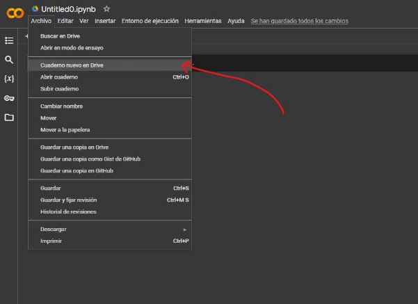

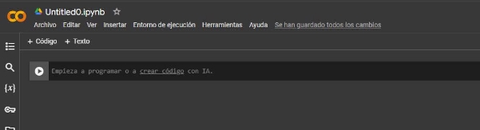

**Paso 3: Instalar Java** 

Apache Spark requiere Java para funcionar, así que necesitamos instalarlo primero. Para ello, abre una celda de código en el cuaderno y pega el siguiente comando:


```bash
!apt-get update –y
```
    

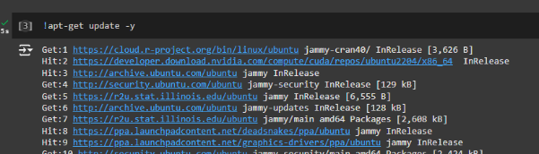

```bash
!apt-get install openjdk-11-jdk –y
```
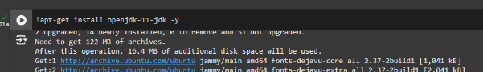

Presiona **Shift + Enter** para ejecutar el comando. Esto instalará OpenJDK 11, que es compatible con Spark. 

**Paso 4: Instalar Apache Spark** 

Ahora que Java está instalado, es el momento de descargar Apache Spark. Añade otra celda de código y ejecuta estos comandos:

Python 

```bash
!wget https://downloads.apache.org/spark/spark-3.5.3/spark-3.5.3- bin-hadoop3.tgz
```

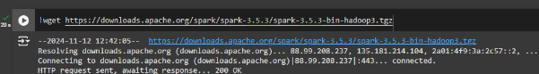

```bash
!tar xvf spark-3.5.3-bin-hadoop3.tgz
```
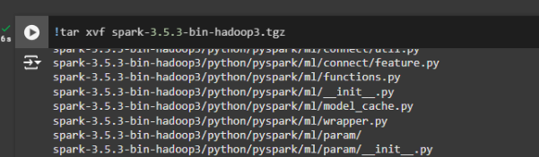

Estos comandos: 

- Descargarán Apache Spark desde un espejo oficial de Apache.
- Descomprimirán el archivo descargado.

**Paso 5: Configurar el entorno**

Después de descargar Spark, necesitamos configurar las variables de entorno para que Python lo reconozca. Añade una celda nueva con el siguiente código:

Python 

```bash
!sudo mv spark-3.5.3-bin-hadoop3 /opt/spark
```

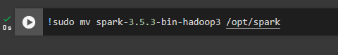

```bash
!export SPARK\_HOME=/opt/spark 
!export PATH=$PATH:$SPARK\_HOME/bin 
```

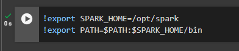

```bash
!source ~/.bashrc
```

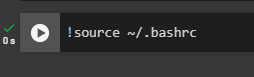

Esto asegura que las herramientas de Spark y Java estén disponibles en el entorno de Colab. 

**Paso 6: Instalar PySpark** 

A continuación, necesitas instalar el paquete de Python que permite interactuar con Spark. Esto lo puedes hacer ejecutando el siguiente comando:

```bash
!pip install pyspark
```

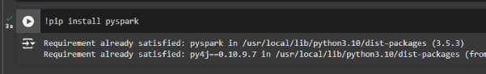

Este comando instalará la biblioteca findspark, que ayuda a encontrar y configurar Spark en el entorno de Python. 

**Paso 7: Inicializar Spark** 

Finalmente, vamos a inicializar Spark. En una nueva celda, añade el siguiente código para hacerlo: 

```bash
from pyspark.sql import SparkSession 

spark = SparkSession.builder \ 
    .appName("TestSpark") \ 
    .getOrCreate() 
```
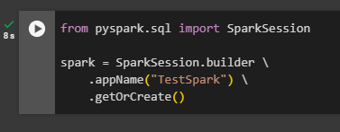

Este paso: 

- Importa la clase SparkSession para interactuar con Spark SQL. 
- Crea o obtiene una sesión de Spark con el nombre "TestSpark". 
- Te permite empezar a trabajar con DataFrames, ejecutar consultas SQL y realizar otras operaciones en Spark de manera más sencilla.

**Paso 8: Verificar que Spark está funcionando**

Para asegurarte de que Spark está funcionando correctamente, puedes probar ejecutar un comando simple como este:

Python.

```bash
# Crea un DataFrame de ejemplo 
df = spark.createDataFrame([(1, "Alice"), (2, "Bob"), (3, "Charlie")], ["id", "name"]) 

# Muestra el contenido del DataFrame 
df.show() 

# Realiza una operación simple 
result = df.select("name").filter(df.id > 1) 
result.show() 
```
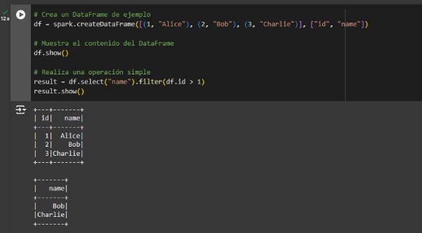

**Paso 9: Cerrar la sesión de spark** 

```bash
spark.stop()
```
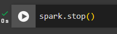
