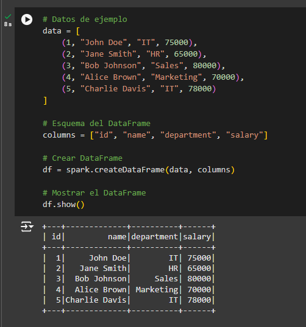

# GOOGLE COLAB

Vamos a ejecutar de forma local Google Colab y ejecutar en sus cuadernos Spark

### Paso 1: Ir a la página web de Google Colab

<https://colab.research.google.com/>

### Paso 2: Abrir Google Colab y crear un cuaderno 


### Paso 3: Instalar Java

Apache Spark requiere Java para funcionar, así que necesitamos instalarlo primero. Para ello, abre una celda de código en el cuaderno y pega el siguiente comando:


```bash
!apt-get update
```
    


```bash
!apt-get install openjdk-11-jdk
```


Presiona **Shift + Enter** para ejecutar el comando. Esto instalará OpenJDK 11, que es compatible con Spark. 

### Paso 4: Instalar Apache Spark

Ahora que Java está instalado, es el momento de descargar Apache Spark. Añade otra celda de código y ejecuta estos comandos:

Python 

```bash
!wget https://downloads.apache.org/spark/spark-3.5.3/spark-3.5.3-bin-hadoop3.tgz
```


```bash
!tar xvf spark-3.5.3-bin-hadoop3.tgz
```


Estos comandos: 

- Descargarán Apache Spark desde un espejo oficial de Apache.
- Descomprimirán el archivo descargado.

### Paso 5: Configurar el entorno

Después de descargar Spark, necesitamos configurar las variables de entorno para que Python lo reconozca. Añade una celda nueva con el siguiente código:

Python 

```bash
!sudo mv spark-3.5.3-bin-hadoop3 /opt/spark
```


```bash
!export SPARK\_HOME=/opt/spark 
!export PATH=$PATH:$SPARK\_HOME/bin 
```


```bash
!source ~/.bashrc
```


Esto asegura que las herramientas de Spark y Java estén disponibles en el entorno de Colab. 

### Paso 6: Instalar PySpark

A continuación, necesitas instalar el paquete de Python que permite interactuar con Spark. Esto lo puedes hacer ejecutando el siguiente comando:

```bash
!pip install pyspark
```


Este comando instalará la biblioteca findspark, que ayuda a encontrar y configurar Spark en el entorno de Python. 

### Paso 7: Inicializar Spark

Finalmente, vamos a inicializar Spark. En una nueva celda, añade el siguiente código para hacerlo: 

```bash
from pyspark.sql import SparkSession 

spark = SparkSession.builder \ 
    .appName("TestSpark") \ 
    .getOrCreate() 
```


Este paso: 

- Importa la clase SparkSession para interactuar con Spark SQL. 
- Crea o obtiene una sesión de Spark con el nombre "TestSpark". 
- Te permite empezar a trabajar con DataFrames, ejecutar consultas SQL y realizar otras operaciones en Spark de manera más sencilla.

### Paso 8: Verificar que Spark está funcionando y hacer consultas

### Consultas usando PySpark
Para asegurarte de que Spark está funcionando correctamente, puedes probar ejecutar un comando simple como este:

Python.

```bash
# Crea un DataFrame de ejemplo 
df = spark.createDataFrame([(1, "Alice"), (2, "Bob"), (3, "Charlie")], ["id", "name"]) 

# Muestra el contenido del DataFrame 
df.show() 

# Realiza una operación simple 
result = df.select("name").filter(df.id > 1) 
result.show() 
```


### Consultas usando SQL.
Instalar, importar e instalar findspark:
```bash
!pip install pyspark findspark
import findspark
findspark.init()
```
**Explicación:** 
1. **`findspark.init()`** inicializa el entorno de `PySpark` para asegurarse de que Python puede encontrar todas las dependencias necesarias.

Crear un nuevo DataFrame para hacer nuevas consultas usando SQL:
```bash
from pyspark.sql import SparkSession
from pyspark.sql.functions import col

# Crear SparkSession
spark = SparkSession.builder \
    .appName("DataFrameExample") \
    .getOrCreate()
```
**Explicación:** 
1. **`SparkSession`**: Es la entrada principal para trabajar con `DataFrames` en PySpark. Aquí se crea una sesión con el nombre "DataFrameExample". `SparkSession` facilita la creación y manipulación de datos estructurados.

**Creación de un DataFrame en PySpark**
```bash
# Datos de ejemplo
data = [
    (1, "John Doe", "IT", 75000),
    (2, "Jane Smith", "HR", 65000),
    (3, "Bob Johnson", "Sales", 80000),
    (4, "Alice Brown", "Marketing", 70000),
    (5, "Charlie Davis", "IT", 78000)
]

# Esquema del DataFrame
columns = ["id", "name", "department", "salary"]

# Crear DataFrame
df = spark.createDataFrame(data, columns)

# Mostrar el DataFrame
df.show()
```


**Explicación:** 
1. Se crea una lista llamada **`data`** con tuplas, donde cada tupla representa una fila de datos con valores específicos (ID, nombre, departamento, y salario).
2. Se define el esquema con los nombres de las columnas a través de la lista **`columns`**.
3. **`spark.createDataFrame(data, columns)`** construye un `DataFrame` a partir de los datos y del esquema definido.
4. **`df.show()`** imprime el contenido del `DataFrame` en la consola.

Creamos una vista temporal del dataframe que hemos creado:
```bash
# Crear vista temporal
df.createOrReplaceTempView("employees")
```
.png)

**Explicación:** 
1. **Crear vista temporal**: Se utiliza `createOrReplaceTempView` para crear una vista temporal llamada `employees`. Esto permite ejecutar consultas SQL directamente sobre el DataFrame.

Apartir de ahi ya podemos hacer consultas SQL refiriendonos a la tabla temporal que acabamos de crear:
```bash
# Consulta SQL para empleados con salario alto
high_salary_sql = spark.sql("SELECT * FROM employees WHERE salary > 70000")
print("Empleados con salario alto (SQL):")
high_salary_sql.show()

# Consulta SQL para salario promedio por departamento
avg_salary_sql = spark.sql("SELECT department, AVG(salary) as avg_salary FROM employees GROUP BY department")
print("Salario promedio por departamento (SQL):")
avg_salary_sql.show()
```
.png)

**Explicación:** 
1. **Consulta SQL para empleados con salario alto**: Con `spark.sql`, se ejecuta una consulta SQL estándar que selecciona todos los empleados con salarios superiores a 70000. El resultado se almacena en `high_salary_sql` y se muestra con `high_salary_sql.show()`.
2. **Consulta SQL para calcular salario promedio por departamento**: Se utiliza otra consulta SQL para calcular el salario promedio por departamento, agrupando los resultados por `department` y utilizando `AVG(salary)` para obtener el promedio. Los resultados se muestran con `avg_salary_sql.show()`.

### Paso 9: Cerrar la sesión de spark

```bash
spark.stop()
```

